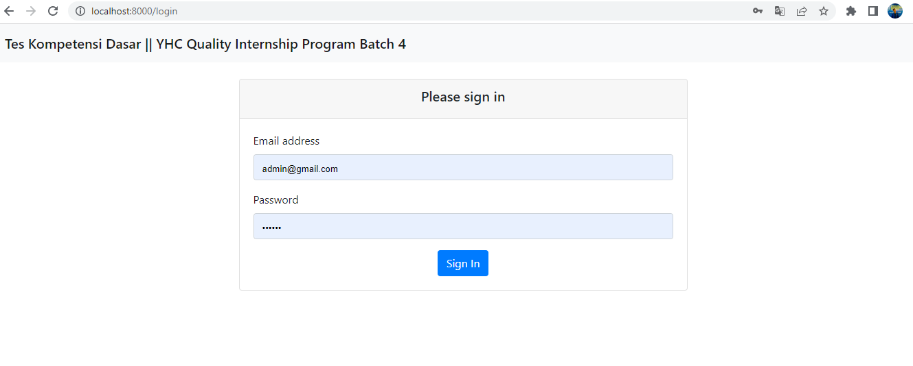
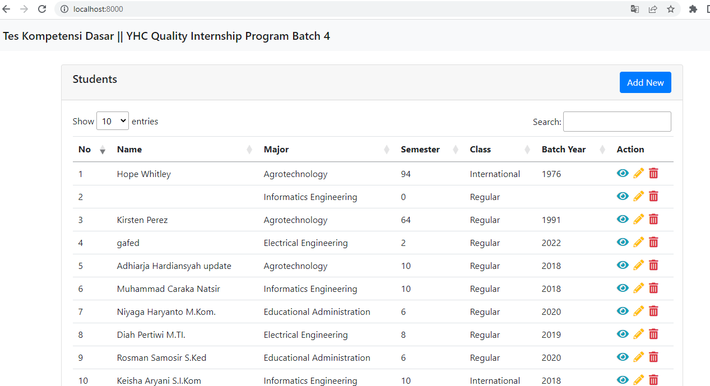
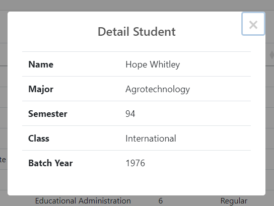
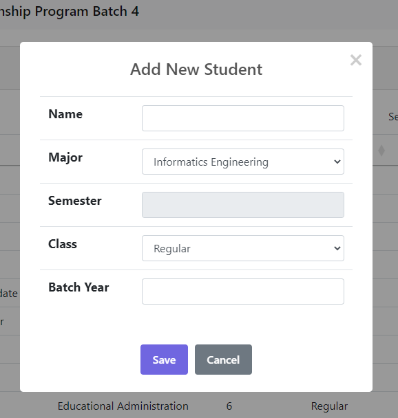
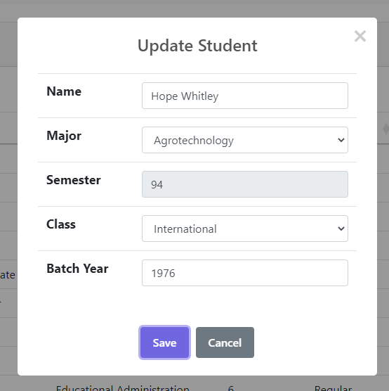
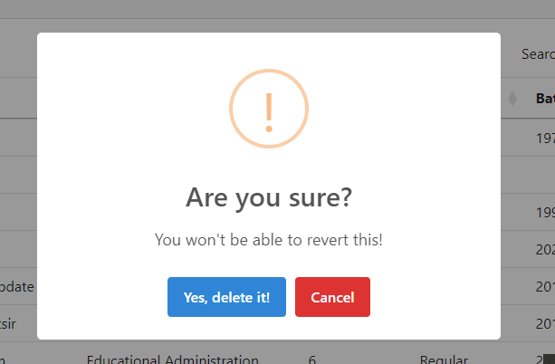

# Data diri
Nama            : Fadoilul Mun'im

Email           : fadoilulmun.im2807@gmail.com

Nomor HP/WA     : 085155214341

Kampus          : Universitas Narotama

Program Studi   : Teknik Informatika

Semester        : 7

Asal            : Surabaya

## System Requirements

Untuk menjalankan project ini anda harus sudah menginstall

`php7`
`postgresql`
`composer`
## Installation

Pertama silahkan clone dan install project ini dengan menjalankan perintah di bawah ini pada terminal.

```bash
  git clone https://github.com/fadoilulmun-im/yhcquipbatch4.git
```
```bash
  cd yhcquipbatch4
```
```bash
  composer install
```
    
Lalu copy isi file .env.example dan buatlah file dengan nama .env dan paste yang sudah di copy tadi pada file ini
## Environment Variables

Untuk menjalankan proyek ini, Anda perlu menyesuaikan variabel berikut di file .env Anda

`DB_CONNECTION=pgsql`

`DB_HOST=127.0.0.1`

`DB_PORT=5432`

`DB_DATABASE=nama_database`

`DB_USERNAME=username_database`

`DB_PASSWORD=password_database`

silahkan sesuaikan dengan settingan yang ada pada komputer anda.
## Run Project

Silahkan jalankan perintah berikut di terminal anda untuk menjalankan Project.

```bash
  php artisan migrate
```
```bash
  php artisan db:seed
```
```bash
  php artisan serve
```

Project sudah bisa di access pada browser dengan alamat http://localhost:8000/

Silahkan login dengan akun admin dibawah ini :
```bash
  email     : admin@gmail.com
  password  : 123456
```
## Screenshots

### Halaman Login


### List data mahasiswa


### Modal detail data


### Modal tambah data


### Modal edit data


### Modal confirm delete data
